# Design Document - RentGuard Platform

## Overview

RentGuard is a comprehensive trust-driven rental ecosystem platform designed to address systemic issues in urban India's rental market. The platform employs a serverless AWS cloud architecture with AI-powered classification systems to create transparency, accountability, and trust throughout the rental lifecycle.

The system integrates four core components: a verified profile system with post-lease mutual ratings, a digital rental logbook for immutable documentation, an AI-powered maintenance classification engine using Amazon SageMaker, and a transparent settlement process. The platform ensures compliance with India's Model Tenancy Act 2021 and implements enterprise-grade security using AWS services.

## AWS Cloud Architecture

### System Architecture Overview

```mermaid
graph TB
    %% Users
    subgraph "Users"
        T[👤 Tenant]
        L[🏠 Landlord] 
        A[⚙️ Admin]
    end
    
    %% Frontend Layer
    subgraph "Frontend Layer"
        CF[☁️ CloudFront CDN]
        S3F[📦 S3 Static Hosting]
        WEB[🌐 Web App]
        MOB[📱 Mobile App]
    end
    
    %% Security & Auth
    subgraph "Authentication & Security"
        COG[🔐 Amazon Cognito]
        WAF[🛡️ AWS WAF]
        IAM[🔑 AWS IAM]
    end
    
    %% API Layer
    subgraph "API Gateway Layer"
        APIG[🚪 API Gateway]
        AUTH[🔒 Authorizer]
    end
    
    %% Business Logic
    subgraph "Lambda Functions"
        L1[⚡ User Management]
        L2[⚡ Rental Agreements]
        L3[⚡ Digital Logbook]
        L4[⚡ Maintenance Classifier]
        L5[⚡ Rating System]
        L6[⚡ Exit Reports]
    end
    
    %% AI/ML Services
    subgraph "AI/ML Services"
        SM[🤖 SageMaker<br/>Damage Classification]
        COMP[🧠 Comprehend<br/>Review Moderation]
    end
    
    %% Data Layer
    subgraph "Data Storage"
        DDB[🗄️ DynamoDB<br/>Structured Data]
        S3D[📦 S3 Bucket<br/>Documents & Images]
    end
    
    %% Monitoring & Notifications
    subgraph "Monitoring & Alerts"
        CW[📊 CloudWatch]
        SNS[📢 SNS Notifications]
    end
    
    %% Data Flow
    T --> CF
    L --> CF
    A --> CF
    
    CF --> S3F
    S3F --> WEB
    S3F --> MOB
    
    WEB --> WAF
    MOB --> WAF
    WAF --> APIG
    
    APIG --> AUTH
    AUTH --> COG
    
    APIG --> L1
    APIG --> L2
    APIG --> L3
    APIG --> L4
    APIG --> L5
    APIG --> L6
    
    L1 --> DDB
    L2 --> DDB
    L3 --> DDB
    L4 --> SM
    L4 --> DDB
    L5 --> COMP
    L5 --> DDB
    L6 --> DDB
    
    L1 --> S3D
    L2 --> S3D
    L3 --> S3D
    L6 --> S3D
    
    L1 --> SNS
    L2 --> SNS
    L4 --> SNS
    L5 --> SNS
    L6 --> SNS
    
    L1 --> CW
    L2 --> CW
    L3 --> CW
    L4 --> CW
    L5 --> CW
    L6 --> CW
    
    IAM -.-> L1
    IAM -.-> L2
    IAM -.-> L3
    IAM -.-> L4
    IAM -.-> L5
    IAM -.-> L6
```



### Serverless Architecture Benefits

**Auto-Scaling**: Lambda functions automatically scale based on demand
**Cost-Effective**: Pay-per-use pricing model with no idle server costs
**High Availability**: Multi-AZ deployments with 99.9% uptime SLA
**Security**: Built-in AWS security with encryption and access controls
**Maintenance-Free**: No server patching or infrastructure management

## Components and Interfaces

### User Management Component (Lambda)

**User Service Interface:**
```typescript
interface UserService {
  registerUser(userData: UserRegistration): Promise<UserResponse>
  verifyDocuments(userId: string, documents: DocumentSet): Promise<VerificationResult>
  updateProfile(userId: string, updates: ProfileUpdate): Promise<UserProfile>
  getProfile(userId: string): Promise<UserProfile>
  checkVerificationStatus(userId: string): Promise<VerificationStatus>
}

interface UserRegistration {
  email: string
  phone: string
  firstName: string
  lastName: string
  userType: 'tenant' | 'landlord' | 'admin'
  preferredLanguage: 'en' | 'hi' | 'regional'
}

interface DocumentSet {
  identityProof: Document // Aadhaar, PAN, Passport
  addressProof: Document // Utility bill, bank statement
  propertyDocuments?: Document[] // For landlords
}

interface VerificationStatus {
  status: 'pending' | 'verified' | 'rejected' | 'expired'
  verifiedAt?: Date
  rejectionReason?: string
  expiresAt: Date
  verificationLevel: 'basic' | 'enhanced' | 'premium'
}
```

### Rating and Review Component (Lambda)

**Rating Service Interface:**
```typescript
interface RatingService {
  checkRatingEligibility(rentalId: string, userId: string): Promise<RatingEligibility>
  submitRating(rentalId: string, rating: RatingSubmission): Promise<void>
  getRatings(userId: string): Promise<UserRatings>
  calculateProfileScore(userId: string): Promise<ProfileScore>
  moderateReview(reviewId: string): Promise<ModerationResult>
  publishRatings(rentalId: string): Promise<void>
}

interface RatingEligibility {
  canRate: boolean
  reason?: 'lease_not_ended' | 'already_rated' | 'timeout_expired' | 'not_verified'
  leaseEndDate?: Date
  timeoutDate?: Date // 30 days after lease end
}

interface RatingSubmission {
  overallRating: number // 1-5
  categoryRatings: {
    transparency: number
    responsiveness: number
    punctuality: number
    propertycare: number
  }
  review: string
  isAnonymous: boolean
  submittedAt: Date
}

interface ProfileScore {
  overallScore: number
  categoryScores: CategoryScores
  totalRatings: number
  verifiedRentals: number
  lastUpdated: Date
}
```

### Digital Logbook Component (Lambda)

**Logbook Service Interface:**
```typescript
interface LogbookService {
  createRentalLogbook(rentalId: string, participants: string[]): Promise<Logbook>
  addEntry(logbookId: string, entry: LogbookEntry): Promise<void>
  getLogbook(logbookId: string, userId: string): Promise<Logbook>
  uploadDocumentation(logbookId: string, files: File[]): Promise<DocumentationEntry>
  searchEntries(logbookId: string, query: SearchQuery): Promise<LogbookEntry[]>
}

interface LogbookEntry {
  id: string
  type: 'communication' | 'maintenance' | 'inspection' | 'payment' | 'incident'
  timestamp: Date
  author: string
  content: string
  attachments?: string[] // S3 URLs
  metadata?: Record<string, any>
  isImmutable: boolean
}

interface Logbook {
  id: string
  rentalId: string
  participants: string[]
  entries: LogbookEntry[]
  createdAt: Date
  lastUpdated: Date
  isActive: boolean
}
```

### AI Classification Component (SageMaker + Lambda)

**AI Classification Service Interface:**
```typescript
interface AIClassificationService {
  classifyMaintenanceIssue(issue: MaintenanceIssue): Promise<ClassificationResult>
  assessPropertyCondition(photos: Photo[], metadata: PropertyMetadata): Promise<ConditionAssessment>
  calculateDepreciation(item: PropertyItem, age: number, usage: UsageData): Promise<DepreciationResult>
  moderateContent(content: string): Promise<ModerationResult>
  trainModel(trainingData: TrainingDataset): Promise<ModelTrainingResult>
}

interface MaintenanceIssue {
  description: string
  photos: Photo[]
  location: string
  reportedBy: string
  propertyAge: number
  tenancyDuration: number
  issueCategory: string
}

interface ClassificationResult {
  responsibility: 'tenant' | 'landlord' | 'shared' | 'insurance'
  confidence: number // 0-1
  reasoning: string
  category: MaintenanceCategory
  estimatedCost?: number
  depreciation?: DepreciationCalculation
}

interface ConditionAssessment {
  overallCondition: 'excellent' | 'good' | 'fair' | 'poor'
  damages: DamageAssessment[]
  wearAndTear: WearAssessment[]
  recommendations: string[]
  aiConfidence: number
}
```

### Settlement Component (Lambda)

**Settlement Service Interface:**
```typescript
interface SettlementService {
  initiateSettlement(rentalId: string): Promise<SettlementProcess>
  generateExitReport(rentalId: string): Promise<ExitReport>
  calculateDeductions(assessment: ConditionAssessment, baseline: ConditionAssessment): Promise<DeductionCalculation>
  finalizeSettlement(settlementId: string, approval: SettlementApproval): Promise<SettlementResult>
  disputeSettlement(settlementId: string, dispute: DisputeDetails): Promise<DisputeProcess>
}

interface ExitReport {
  rentalId: string
  moveInCondition: ConditionAssessment
  moveOutCondition: ConditionAssessment
  comparisonAnalysis: ComparisonResult[]
  recommendedDeductions: DeductionItem[]
  totalDeduction: number
  netRefund: number
  generatedAt: Date
  evidenceUrls: string[] // S3 URLs
}

interface DeductionItem {
  item: string
  category: 'damage' | 'cleaning' | 'repair' | 'replacement'
  cost: number
  justification: string
  evidence: string[] // S3 URLs
  depreciation: DepreciationCalculation
}
```

## Data Models (DynamoDB)

### Core Entity Models

**User Model:**
```typescript
interface User {
  PK: string // USER#{userId}
  SK: string // PROFILE
  id: string
  email: string
  phone: string
  profile: UserProfile
  verification: VerificationRecord
  ratings: RatingsSummary
  createdAt: Date
  updatedAt: Date
  GSI1PK: string // USER_TYPE#{userType}
  GSI1SK: string // CREATED#{createdAt}
}

interface UserProfile {
  firstName: string
  lastName: string
  dateOfBirth: Date
  address: Address
  preferredLanguage: string
  userType: 'tenant' | 'landlord' | 'admin'
  profilePhoto?: string // S3 URL
  isActive: boolean
}

interface VerificationRecord {
  status: VerificationStatus
  documents: VerifiedDocument[]
  verifiedAt?: Date
  expiresAt?: Date
  verificationLevel: 'basic' | 'enhanced' | 'premium'
  kycProvider: string
}
```

**Rental Agreement Model:**
```typescript
interface RentalAgreement {
  PK: string // RENTAL#{rentalId}
  SK: string // AGREEMENT
  id: string
  landlordId: string
  tenantId: string
  propertyId: string
  terms: RentalTerms
  status: 'draft' | 'active' | 'terminated' | 'disputed'
  digitalSignatures: Signature[]
  registrationDetails: RegistrationRecord
  logbookId: string
  createdAt: Date
  startDate: Date
  endDate?: Date
  GSI1PK: string // LANDLORD#{landlordId}
  GSI1SK: string // STATUS#{status}#{startDate}
  GSI2PK: string // TENANT#{tenantId}
  GSI2SK: string // STATUS#{status}#{startDate}
}

interface RentalTerms {
  monthlyRent: number
  securityDeposit: number
  maintenanceCharges?: number
  utilitiesIncluded: string[]
  restrictions: string[]
  renewalTerms?: RenewalClause
  modelTenancyActCompliant: boolean
}
```

**Property Model:**
```typescript
interface Property {
  PK: string // PROPERTY#{propertyId}
  SK: string // DETAILS
  id: string
  ownerId: string
  address: Address
  details: PropertyDetails
  amenities: string[]
  photos: PropertyPhoto[] // S3 URLs
  documents: PropertyDocument[] // S3 URLs
  currentCondition: ConditionAssessment
  maintenanceHistory: MaintenanceRecord[]
  createdAt: Date
  updatedAt: Date
  GSI1PK: string // OWNER#{ownerId}
  GSI1SK: string // CREATED#{createdAt}
}

interface PropertyDetails {
  type: 'apartment' | 'house' | 'room' | 'commercial'
  bedrooms: number
  bathrooms: number
  area: number
  furnishingStatus: 'furnished' | 'semi-furnished' | 'unfurnished'
  constructionYear: number
  floor?: number
  totalFloors?: number
}
```

**Maintenance Request Model:**
```typescript
interface MaintenanceRequest {
  PK: string // RENTAL#{rentalId}
  SK: string // MAINTENANCE#{requestId}
  id: string
  rentalId: string
  reportedBy: string
  assignedTo?: string
  issue: MaintenanceIssue
  classification: ClassificationResult
  status: 'reported' | 'acknowledged' | 'in_progress' | 'resolved' | 'disputed'
  resolution?: MaintenanceResolution
  timeline: MaintenanceTimeline[]
  createdAt: Date
  resolvedAt?: Date
  GSI1PK: string // STATUS#{status}
  GSI1SK: string // CREATED#{createdAt}
}

interface MaintenanceResolution {
  description: string
  cost: number
  paidBy: string
  photos: Photo[] // S3 URLs
  warranty?: WarrantyDetails
  completedAt: Date
}
```

**Rating Model:**
```typescript
interface Rating {
  PK: string // RENTAL#{rentalId}
  SK: string // RATING#{userId}
  rentalId: string
  raterId: string
  ratedUserId: string
  rating: RatingSubmission
  status: 'submitted' | 'published' | 'disputed'
  submittedAt: Date
  publishedAt?: Date
  moderationResult?: ModerationResult
  GSI1PK: string // RATED_USER#{ratedUserId}
  GSI1SK: string // PUBLISHED#{publishedAt}
}
```

## Security Architecture

### AWS Security Services Integration

**Authentication & Authorization:**
- **Amazon Cognito**: JWT token-based authentication with user pools
- **API Gateway Authorizers**: Lambda-based token validation and RBAC
- **AWS IAM**: Service-to-service authentication with least privilege

**Data Protection:**
- **AWS KMS**: Encryption keys for S3 and DynamoDB
- **S3 Encryption**: Server-side encryption for all uploaded files
- **DynamoDB Encryption**: Encryption at rest for all table data
- **TLS 1.3**: Encryption in transit for all API communications

**Network Security:**
- **AWS WAF**: Web application firewall with custom rules
- **CloudFront**: DDoS protection and geographic restrictions
- **VPC Endpoints**: Secure service-to-service communication

### Access Control Matrix

| User Type | User Mgmt | Rentals | Logbook | Maintenance | Ratings | Settlements | Admin |
|-----------|-----------|---------|---------|-------------|---------|-------------|-------|
| Tenant    | Own Only  | Own Only| Participant | Submit | Post-Lease | View Own | No |
| Landlord  | Own Only  | Own Only| Participant | Respond | Post-Lease | View Own | No |
| Admin     | All       | All     | All     | All         | Moderate | All | Yes |

## Performance Architecture

### Scalability Design

**Auto-Scaling Components:**
- **Lambda Functions**: Automatic scaling up to 10,000 concurrent executions
- **DynamoDB**: On-demand scaling with burst capacity
- **S3**: Unlimited storage with automatic scaling
- **CloudFront**: Global edge locations for content delivery

**Performance Optimizations:**
- **DynamoDB GSIs**: Optimized query patterns for common access patterns
- **S3 Transfer Acceleration**: Faster file uploads for global users
- **CloudFront Caching**: Static content caching with TTL optimization
- **Lambda Provisioned Concurrency**: Pre-warmed functions for critical paths

### Monitoring and Observability

**CloudWatch Integration:**
- **Custom Metrics**: Business KPIs and system performance
- **Log Aggregation**: Centralized logging from all Lambda functions
- **Alarms**: Automated alerting for system health and errors
- **Dashboards**: Real-time monitoring for operations team

**Performance Targets:**
- **API Response Time**: < 2 seconds for 95% of requests
- **File Upload**: < 30 seconds for 10MB files
- **Search Queries**: < 1 second for logbook searches
- **Settlement Processing**: < 24 hours for automated settlements

## Deployment Architecture

### Infrastructure as Code

**AWS CloudFormation Templates:**
```yaml
# Core infrastructure stack
Resources:
  UserPool:
    Type: AWS::Cognito::UserPool
    Properties:
      UserPoolName: RentGuard-Users
      MfaConfiguration: OPTIONAL
      
  ApiGateway:
    Type: AWS::ApiGateway::RestApi
    Properties:
      Name: RentGuard-API
      EndpointConfiguration:
        Types: [REGIONAL]
        
  UserTable:
    Type: AWS::DynamoDB::Table
    Properties:
      TableName: RentGuard-Users
      BillingMode: ON_DEMAND
      PointInTimeRecoveryEnabled: true
```

**CI/CD Pipeline:**
- **AWS CodePipeline**: Automated deployment pipeline
- **AWS CodeBuild**: Build and test automation
- **AWS CodeDeploy**: Blue-green deployments for Lambda functions
- **Parameter Store**: Environment-specific configuration

### Environment Strategy

**Development Environment:**
- Separate AWS account with reduced capacity
- Mock external services for testing
- Automated testing with synthetic data

**Production Environment:**
- Multi-AZ deployment for high availability
- Automated backups and disaster recovery
- Real-time monitoring and alerting

## Cost Architecture

### Cost Optimization Strategy

**Serverless Benefits:**
- **No Idle Costs**: Pay only for actual usage
- **Automatic Scaling**: No over-provisioning
- **Managed Services**: Reduced operational overhead

**Cost Monitoring:**
- **AWS Cost Explorer**: Usage tracking and forecasting
- **Budget Alerts**: Automated cost threshold notifications
- **Resource Tagging**: Cost allocation by feature/environment

### Estimated Monthly Costs

**Development Environment (100 users):**
- Lambda Functions: $20
- DynamoDB: $50
- S3 Storage: $15
- API Gateway: $10
- **Total: ~$95/month**

**Production Environment (10,000 users):**
- Lambda Functions: $200
- DynamoDB: $300
- S3 Storage: $100
- SageMaker: $400
- CloudFront: $50
- **Total: ~$1,050/month**

---

**Architecture Summary:**
🏗️ **Serverless AWS Architecture** with auto-scaling and cost optimization  
🔐 **Enterprise Security** with encryption, authentication, and access controls  
🤖 **AI-Powered Intelligence** using SageMaker and Comprehend  
📱 **Mobile-First Design** optimized for Indian smartphone users  
🏛️ **Regulatory Compliance** built for Indian rental laws and data protection  
⚡ **High Performance** with sub-2-second response times and 99.9% uptime
